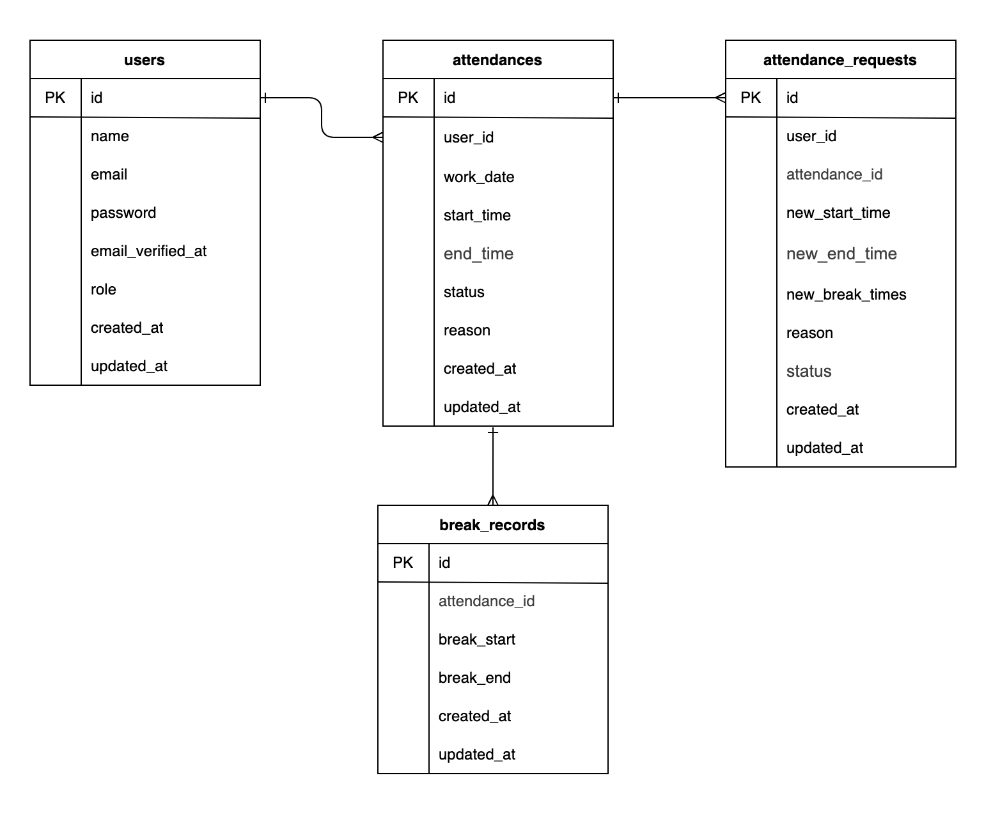

# **アプリケーション名**

attendance-management-app

## **プロジェクト概要**

このアプリケーションは、ユーザーの勤怠と管理を目的とした勤怠管理アプリです。

### **主な機能**

- ユーザー登録・ログイン（メール認証対応）

---

## **環境構築**

### **Docker ビルド**

1. リポジトリをクローン:

   ```bash
   git@github.com:shun1019/attendance-management-app.git
   cd attendance-management-app
   ```

2. DockerDesktop アプリを立ち上げる:

   ```bash
   docker-compose up -d --build
   ```

3. **(Mac の M1/M2 チップでエラーが発生する場合)**
   - 以下の設定を `docker-compose.yml` に追加してください:
   ```yaml
   mysql:
     platform: linux/amd64
   phpmyadmin:
     platform: linux/amd64
   mailhog:
     platform: linux/amd64
   ```

---

### **Laravel 環境構築**

1. PHP コンテナに入ります:

   ```bash
   docker-compose exec php bash
   ```

2. 依存関係をインストール:

   ```bash
   composer install
   ```

3. `.env` ファイルを作成:

   ```bash
   cp .env.example .env
   ```

4. 環境変数を設定・追加:

   ```env
   APP_NAME=Laravel
   APP_ENV=local
   APP_KEY=base64:FA0/obGVuwXyhgnCfBqJNjVMvnqPb6wwlqAF9Z5w3HU=
   APP_DEBUG=true
   APP_URL=${NGROK_URL:-http://localhost}

   DB_CONNECTION=mysql
   DB_HOST=mysql
   DB_PORT=3306
   DB_DATABASE=laravel_db
   DB_USERNAME=laravel_user
   DB_PASSWORD=laravel_pass

   MAIL_MAILER=smtp
   MAIL_HOST=mailhog
   MAIL_PORT=1025
   MAIL_USERNAME=null
   MAIL_PASSWORD=null
   MAIL_ENCRYPTION=null
   MAIL_FROM_ADDRESS=example@example.com
   MAIL_FROM_NAME="${APP_NAME}"

   ```

5. アプリケーションキーを生成:

   ```bash
   php artisan key:generate
   ```

6. マイグレーションを実行:

   ```bash
   php artisan migrate
   ```

7. シーディングを実行:

   ```bash
   php artisan db:seed
   ```

8. キャッシュクリア:
   ```bash
   php artisan config:clear
   php artisan cache:clear
   php artisan route:clear
   php artisan view:clear
   ```

9.	ストレージへのシンボリックリンクを作成
   ```bash
   php artisan storage:link
   ```

10. テストの実行
   ```bash
   php artisan test
   ```

---

### **メール認証（MailHog の使用）**

このアプリケーションでは、メール認証に **MailHog** を使用します。

#### **MailHog の起動手順**

Docker コンテナを起動すると、MailHog も自動的に起動します。

#### **メール確認手順**

1. ユーザー登録後、認証メールが送信される
2. MailHog にアクセス：http://localhost:8025
3. メールを開き、認証リンクをクリックして完了

---

## 使用技術(実行環境)

- PHP 7.4.9
- Laravel 8.83.8
- Docker
- MySQL 8.0.26
- Laravel Fortify: 1.19
- MailHog

## ER 図



## URL

- 開発環境: [http://localhost/]
- phpMyAdmin: [http://localhost:8080/]
- MailHog: [http://localhost:8025]
